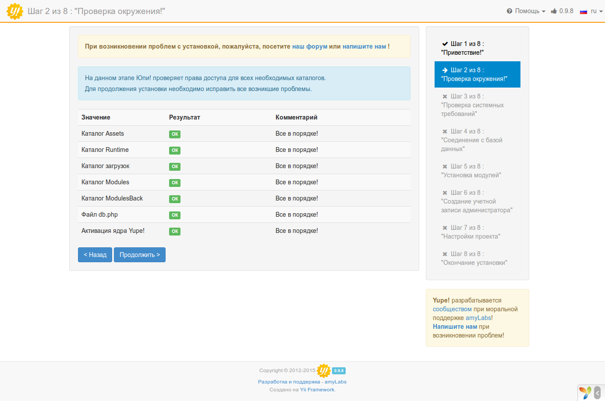
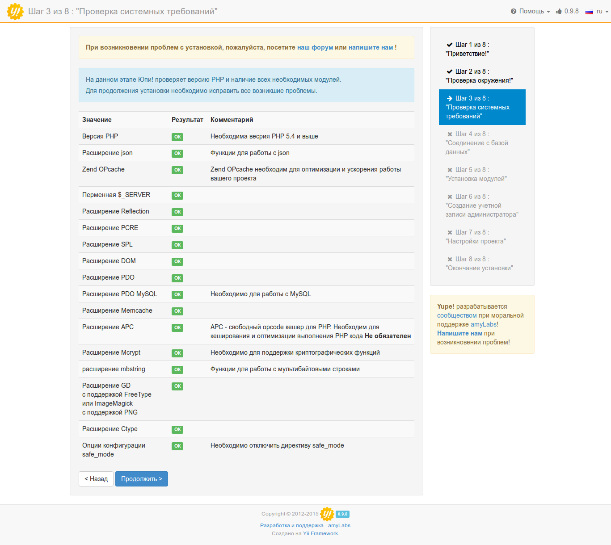
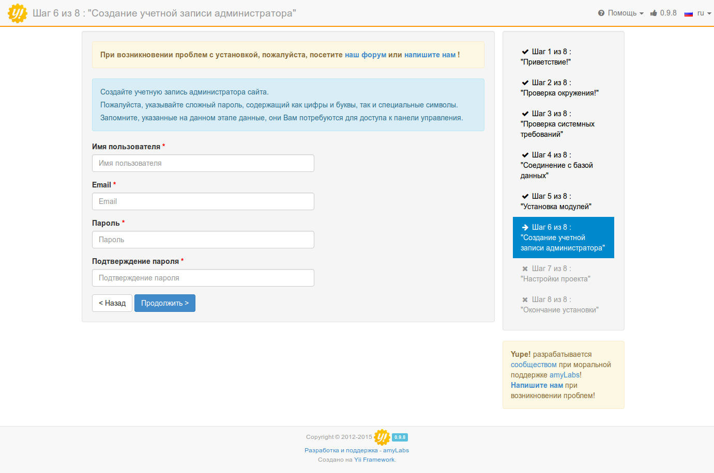
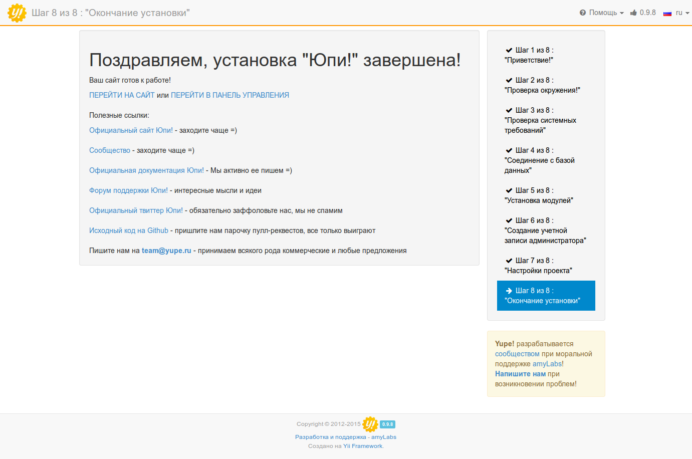

# Установка и запуск "Юпи!"

Юпи! нетребовательна к ресурсам, поэтому для проектов с невысокой посещаемостью подойдет любой виртуальный хостинг, на котором будет установлены PHP (не ниже 5.4) и MySQL. Обо всех других расширениях, необходимых для работы сайта, вы будете проинформированы на 3-м шаге установки системы.

Развертывание проекта на сервере возможно тремя способами: 
* через Composer,
* клонирование репозитория с GitHub,
* из zip-архива.

## Развертывание через Composer

> Для развертывания Юпи! вам понадобится [Composer](https://getcomposer.org/) и [Git](http://git-scm.com/downloads). В данной документации подразумевается глобальная установка Composer-а, если в вашем случае это не так, то вместо команды `composer` нужно писать `php composer.phar`

Установка последней стабильной версии производится командой: 
```
composer create-project yupe/yupe <директория проекта> --no-dev --prefer-dist
```

Директорию проекта можно не указывать, в таком случае файлы Юпи! будут помещены в папку `yupe` в текущей директории.    

Если вам нужно установить другую версию системы, например ту, что на данный момент находится в разработке, то нужно немного модифицировать уже известную нам команду:

```
composer create-project yupe/yupe:<номер версии>.x-dev <директория проекта> --no-dev --prefer-dist
```

Номер необходимой версии можно посмотреть на сайте [packagist.org](https://packagist.org/packages/yupe/yupe)

Composer самостоятельно скопирует файлы проекта и все зависимости, после чего проведет необходимые для установки подготовительные действия.
После успешного завершения процедуры вы можете переходить к установке системы.

## Развертывание через Git

> Для развертывания этим способом вам понадобится [Composer](https://getcomposer.org/) и [Git](http://git-scm.com/downloads). В данной документации подразумевается глобальная установка Composer-а, если в вашем случае это не так, то вместо команды `composer` нужно писать `php composer.phar`

Клонируем проект:
```
git clone https://github.com/yupe/yupe.git <директория проекта>
```

Если не указывать целевую директорию, то файлы проекта будут размещены в папке `yupe`.
После завершения клонирования, переходим в директорию проекта и устанавливаем зависимости через Composer:
```
composer install
```

Теперь можно переходить к установке Юпи!

## Развертывание из архива

Как правило, виртуальные хостинги не предоставляют возможности воспользоваться предыдущими способами установки. Если вы оказались в такой ситуации, то можете [скачать](http://yupe-project.ru/download) полный архив Юпи! со всеми установленными зависимостями. Вам нужно только его распаковать и переходить к следующему шагу.

## Установка Юпи!

Чтобы проверить, что все сделано правильно, введите в браузере адрес своего сайта. Вы увидите экран приветствия инсталлятора Юпи!, на котором будет предложено выбрать язык установки.


**Шаг 2**: Проверка окружения



**Возможные проблемы**: неправильные права доступа к необходимым директориям.
Поменять права доступа можно командой в терминале `chmod 0777 <путь к директории>`, через ваш любимый FTP-менеджер (например FileZilla) или через файловый менеджер панели управления.

Расположение необходимых директорий в структуре проекта:

Значение | Путь
-------- | ------
Каталог Assets  | public/assets
Каталог Runtime | protected/runtime
Каталог загрузок | public/uploads
Каталог Modules | protected/config/modules
Каталог ModulesBack | protected/config/modulesBack
Файл db.php | protected/config

**Шаг 3**: Проверка системных требований



**Возможные проблемы**: не установлены необходимые расширения.

Виртуальные хостинги позволяют управлять расширениями PHP через панель управления. 
Если такой возможности нет, то обратитесь к вашему системному администратору или в службу поддержки хостинга.
_Обратите внимание, что не все расширения обязательны._

**Шаг 4**: Соединение с базой данных

На этом этапе вы указываете данные для соединения с базой данных, которые вам предоставил хостер.


**Шаг 5**: Установка модулей

Этот шаг позволяет вам выбрать необходимые для установки модули. 

После загрузки страницы отмечены рекомендованные модули, а также доступны три варианта: “Интернет-магазин”, “Только основные”, “Все”.

Вы можете выбрать нужные вам модули или изменить стандартные варианты, при этом будет автоматически изменяться состояние всех зависимых модулей.

Обратите внимание, что после установки системы, модулями можно будет управлять из административной панели. Если вы не уверены в том, какие модули вам могут понадобиться или забыли отметить нужный - ничего страшного, вы всегда можете к ним вернуться.


**Шаг 6**: Создание учетной записи администратора



**Шаг 7**: Настройки проекта


**Шаг 8**: Окончание установки

Надеемся, что все прошло хорошо и вас можно поздравить с успешной установкой Юпи!


