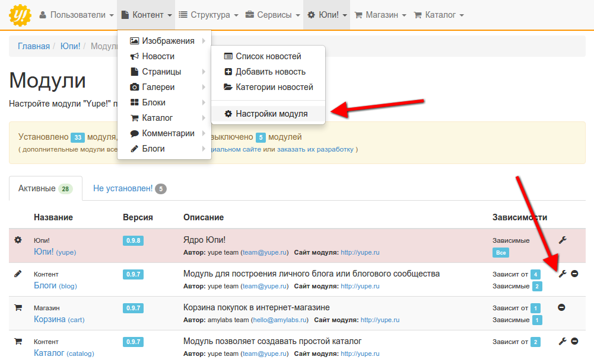
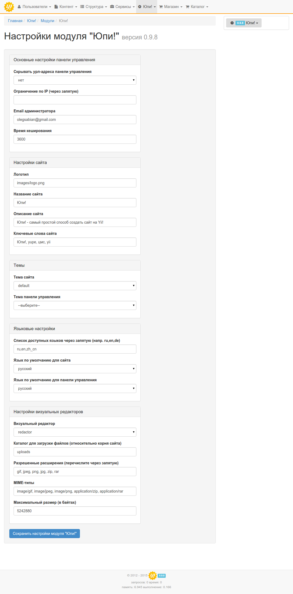

# Управление модулями

Управлять модулями системы вы можете в панели администрирования сайта, в разделе "Модули". Здесь в разных вкладках отображаются уже установленные, отключенные, ожидающие обновления и модули, которые вы можете установить.

Управление модулями интуитивно понятно, поэтому никаких трудностей у вас возникнуть не должно. Примите во внимание, что при отключении модуля, также отключатся все зависящие от него модули, если таковые имеются.

# Настройки

Изменение настроек возможно как из меню "Модули", так и в соответствующем пункте меню нужного вам модуля.

Система содержит большое количество модулей с еще большим количеством настроек, поэтому описывать каждый не имеет смысла: все настройки снабжены понятными названиями, либо сопровождаются описаниями. Однако, в качестве примера, стоит рассмотреть некоторые настройки самого главного модуля Юпи!

Здесь вы можете ограничить доступ к панели управления по IP-адресу, задать ключевые слова и описание сайта, которые будут отображаться по умолчанию для всех страниц, и управлять типами файлов, разрешенных для загрузки через визуальный редактор.

