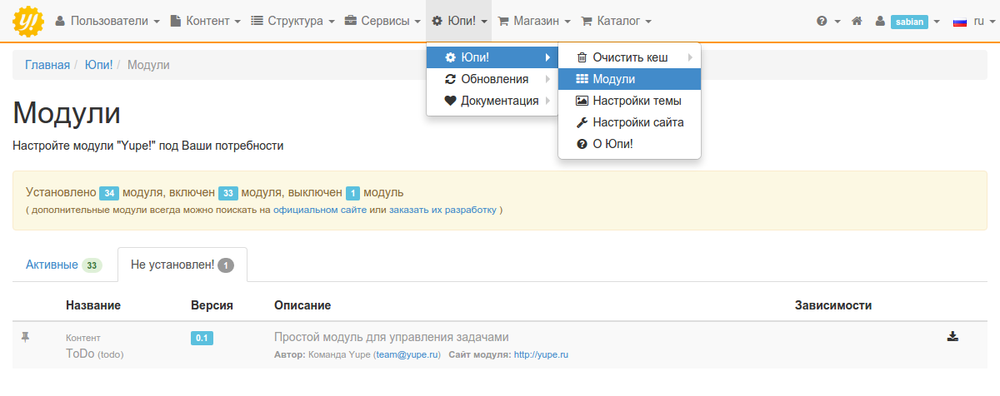
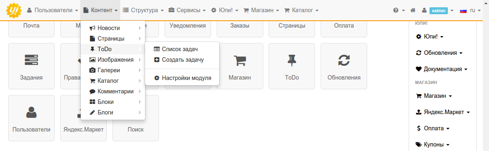
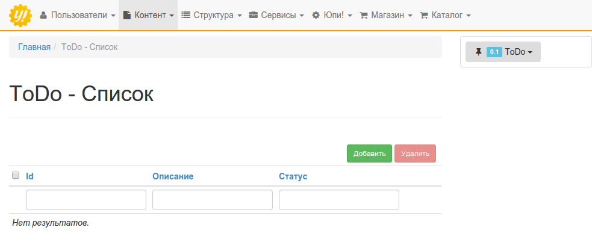
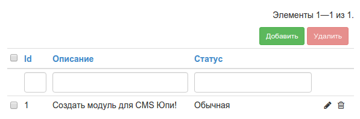
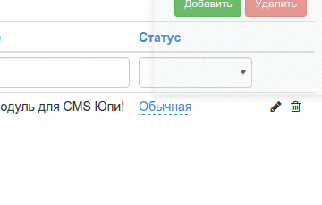

# Создание собственного модуля

## Введение
Команда Юпи! активно развивает систему и внедряет новые возможности, но надо признать, что мы не всесильны и не можем удовлетворить потребностей всех пользователей. В этой главе мы постараемся максимально подробно осветить вопрос создания собственных модулей для Юпи!, чтобы вы могли самостоятельно улучшить свой проект или может даже разместить модуль в нашем [Маркете](http://yupe.ru/marketplace).

Если вы не знакомы с фреймворком [Yii](http://yiiframework.ru/doc/guide/ru/quickstart.what-is-yii), то для более легкого понимания материала, рекомендую вам ознакомиться с шаблоном проектирования [MVC](http://yiiframework.ru/doc/guide/ru/basics.mvc), [модулями](http://yiiframework.ru/doc/guide/ru/basics.module) фреймворка, а еще лучше - изучить учебное пособие по [созданию блога](http://yiiframework.ru/doc/blog/ru/start.overview).

## Описание модуля
Поскольку нашей задачей является обучение, а не изобретение чего-то нового и интересного, то мы будем создавать простенький модуль задач "ToDo". Думаю, для наших целей этого будет достаточно.
Дабы не усложнять процесс, сделаем допущение, что в системе может быть зарегистрирован только один пользователь. Это позволит нам не разделять списки задач. В качестве домашнего задания вы можете реализовать эту возможность самостоятельно.

Все этапы разработки будут оформлены в отдельные коммиты, которые вы сможете посмотреть на [GitHub](https://github.com/sabian/yupe-todo).
Возникшие вопросы можно задать на нашем [форуме](http://yupe.ru/talk/).

##### Список требований:
**backend**
- должна быть возможность создавать, редактировать и удалять задачи;
- реализовать поиск по задачам и фильтрацию по статусу;
- inline-редактирование статусов задач;
- изменение приоритета задач перетаскиванием мышью (drag&drop);
- на главной странице панели управления отображать уведомления о количестве невыполненных задач.

**frontend**
- создать страницу со списком задач и предоставить возможность пометить задачу как выполненную;
- сделать виджет, отображающий активные задачи, и разместить кнопку для перехода на страницу редактирования.

Да, можно сделать всё гораздо проще, но нам бы хотелось охватить как можно больше различных аспектов создания модуля.

## Каркас модуля
Сначала нужно создать минимально возможную структуру модуля, для того, чтобы можно было включить его в панели управления и визуально наблюдать изменения в процессе его создания. 
>Для большего понимания материала, мы не будем использовать генератор кода (Gii), а создадим каждый файл и директорию вручную. Конечно, в будущем вы можете использовать его для упрощения работы. Прочитать как это сделать, можно [здесь](http://yupe.ru/docs/module.create.html).

Дальнейшие действия подразумевают, что у вас установлена последняя стабильная версия Юпи! и открыт любимый редактор кода с добавленными в проект файлами системы.

В `protected/modules` создаем директорию `todo` для нашего модуля. Все дальнейшие действия будут проводиться внутри этой категории. 

Создаем основной файл модуля `TodoModule.php` с одноименным классом, расширяющим компонент `WebModule` модуля `yupe`.

```php
use yupe\components\WebModule;

class TodoModule extends WebModule 
{
    
}
```

И добавляем в него методы:

**getDependencies** - возвращает массив модулей, от которых будет зависеть наш модуль. Допустим, если бы мы хотели добавить комментарии к нашим задачам и возможность добавления изображений, то нужно было бы написать так:
```php
return ['image', 'comment'];
```
Наш модуль вполне самостоятелен, поэтому мы вернем пустой массив.

**getVersion** - возвращает версию вашего модуля для отображения в панели управления.

**getCategory** - сообщает системе в какой вкладке меню, панели управления, отображать меню нашего модуля. Т.е., если мы хотим разместить его в меню "Контент", то так и напишем:
```php
return 'Контент';
```

**getName** - возвращает название модуля.

**getDescription** - краткое описание модуля.

**getAuthor** - имя автора или компании, создавшей модуль.

**getAuthorEmail** - email-адрес.

**getUrl** - ссылка на сайт автора или на демонстрационный сайт.

**getIcon** - иконка модуля. Указывается в формате `fa fa-fw <название>`. Выбрать подходящую иконку и узнать ее название можно на сайте [FontAwesome](https://fortawesome.github.io/Font-Awesome/icons/). В этом модуле используем иконку [thumb-tack](http://fortawesome.github.io/Font-Awesome/icon/thumb-tack/), значит метод должен вернуть строку `fa fa-fw fa-thumb-tack`.

**getAdminPageLink** - здесь указывается ссылка на какую-либо страницу (чаще главную) модуля. Она нужна для отображения кнопки модуля на главной странице панели управления. Строится она по следующему правилу: `/<название модуля>/<название контроллера>/<действие>`. Для модуля она примет такой вид: `/todo/todoBackend/index`.

**getNavigation** - сообщает системе о структуре меню модуля. Он крайне простой, поэтому сделаем только два пункта: просмотр списка задач и создание задачи.
```php
return [
    [
        'icon'  => 'fa fa-fw fa-list-alt',
        'label' => 'Список задач',
        'url'   => ['/todo/todoBackend/index']
    ],
    [
        'icon'  => 'fa fa-fw fa-plus-square',
        'label' => 'Создать задачу',
        'url'   => ['/todo/todoBackend/create']
    ],
];
```
Эти данные будут использованы для генерации главного меню панели управления.

Осталось создать еще один файл и мы сможем установить модуль, чтобы потом, добавляя функционал, можно было наблюдать за изменениями в панели управления.

Создаем директорию `install`, в которой размещаем файл с точно таким же названием, как и модуль - `todo.php`. В нем будет храниться конфигурация модуля, где, для начала, мы просто сообщим системе о его существовании:
```php
return [
    'module'    => [
        'class' => 'application.modules.todo.TodoModule',
    ],
];
```
Строчка `application.modules.todo.TodoModule` - это путь до главного класса модуля, где `application` указывает на директорию `protected`. 

Вот и все! Если все сделано правильно, то в разделе "Модули", во вкладке "Не установлен!", мы должны увидеть наш модуль.


После установки модуля вы должны увидеть пункт "ToDo" в главном меню и кнопку на главной странице панели управления.


И, хотя в нем еще ничего не отображается, кроме названия и меню модуля, а впереди нас ждет еще уйма работы, я думаю, можно вас поздравить с этим маленьким, но очень важным шагом.

Детально изучить созданные файлы вы можете в [этом коммите на GitHub](https://github.com/sabian/yupe-todo/commit/4ee5d8b316279d2c27c5a536b7fd4033be94db01). А если возникли вопросы, то смело задавайте их на нашем [форуме](http://yupe.ru/talk/). Будем рады помочь!

## Миграции
Теперь пришло время задуматься над структурой таблицы модуля и создании миграции. О том, что такое миграции, для чего они нужны и как с ними работать, вы можете прочитать в [официальном руководстве](http://yiiframework.ru/doc/guide/ru/database.migration).

В модулях Юпи! файлы миграций хранятся в директории `install/migrations`. Перед тем как продолжать, убедитесь, что вы ее создали.

Далее, в консоли, находясь в корневой папке вашего проекта, выполняем команду `php protected/yiic migrate create todo yupe_todo_table`. Этой командой мы создаем файл миграции `yupe_todo_table` для модуля `todo`. 

Если все прошло хорошо, то на данный момент у вас должна быть следующая структура директорий:

```
.
├── install
│   ├── migrations
│   │   └── m151205_141508_yupe_todo_table.php
│   └── todo.php
├── LICENSE
├── README.md
└── TodoModule.php
```

Теперь, в созданном файле, нужно описать поля таблицы для хранения задач. 
Согласно, описанным выше, требованиям к модулю, у задачи должно быть описание, статус и сортировка.

```php
class m151205_141508_yupe_todo_table extends yupe\components\DbMigration
{
    public function safeUp()
    {
        $this->createTable('{{todo}}', [
            'id' => 'pk',
            'description' => 'string NOT NULL',
            'status' => 'TINYINT(1) NOT NULL DEFAULT 1',
            'sort' => 'integer NOT NULL DEFAULT 1',
        ], $this->getOptions());
    }

    public function safeDown()
    {
        $this->dropTable('{{todo}}');
    }
}
```

Обратите внимание, что название таблицы заключено в двойные фигурные скобки `{{todo}}`. Это сделано для того, чтобы система автоматически подставила префикс для таблиц, который задается на этапе установки. Если вы ничего не меняли, то после применения миграции в базе данных должна появиться таблица `yupe_todo`.

Метод `getOptions` добавляет параметры таблицы: `ENGINE=InnoDB DEFAULT CHARSET=utf8`

Осталось только ввести команду `php protected/yiic migrate --module=todo` и подтвердить что хотите применить миграцию.

После успешного завершения операции, в базе данных должна появиться таблица со следующей структурой:

```
+-------------+--------------+------+-----+---------+----------------+
| Field       | Type         | Null | Key | Default | Extra          |
+-------------+--------------+------+-----+---------+----------------+
| id          | int(11)      | NO   | PRI | NULL    | auto_increment |
| description | varchar(255) | NO   |     | NULL    |                |
| status      | tinyint(1)   | NO   |     | 1       |                |
| sort        | int(11)      | NO   |     | 1       |                |
+-------------+--------------+------+-----+---------+----------------+
```

Результат на [GitHub](https://github.com/sabian/yupe-todo/commit/7feff834d603f30d86debccd151738145243455e)

## Модель
Учитывая, что официальное руководство по Yii фреймворку предоставляет исчерпывающую информацию о [моделях](http://yiiframework.ru/doc/guide/ru/basics.model), их [создании](http://yiiframework.ru/doc/guide/ru/form.model) и [работе с базой данных](http://yiiframework.ru/doc/guide/ru/database.overview), лучше сразу перейти к делу.

В Юпи! есть базовый класс `YModel`, от которого должны быть унаследованы все модели. Исходя из этого, определяем класс:
```php
use yupe\models\YModel;

class Todo extends YModel
{
    
}
```

На этом этапе понадобится переопределить только три метода:
- **tableName** - возвращает название таблицы в базе данных. Здесь все просто, это будет строка `{{todo}}`;
- **rules** - правила валидации данных;
- **attributeLabels** - возвращает список меток аттрибутов в формате `'Атрибут' => 'Описание'`.

Все остальное будем дописывать при первой необходимости.

Посмотреть на получившийся код вы можете в соответствующем коммите на GitHub, ссылка на который указана в конце этого раздела.
А пока опишем требования для правил валидации:
- поле `description` должно быть обязательным и иметь длину не более 255 символов;
- поля `status` и `sort` должны быть целочисленными.

```php
['description', 'required'],
['description', 'length', 'max' => 255],
['status, sort', 'numerical', 'integerOnly' => true],
```

Пока это все, что мы можем написать в модели. В дальнейшем придется добавить несколько правил валидации и методов, а пока можно изучить [полученный результат](https://github.com/sabian/yupe-todo/commit/6330d8a7ec06a8dd86976b10514cce34df571ce0).

## Backend
Если у вас возникли вопросы по предыдущим шагам руководства, то можете смело задавать их на [форуме](http://yupe.ru/talk/). Возможно, это поможет нам дополнить руководство и сделать его более понятным.

На этом этапе, пожалуй, самым логичным будет создание административной части модуля. Начнем с контроллера.

В методе `getNavigation` (файл TodoModule.php) ссылки на пункты меню имеют следующий вид: `['/todo/todoBackend/index']`. Как уже говорилось ранее, они создаются по принципу `/название модуля/название контроллера/действие`. Из этого следует, что контроллер должен называться `TodoBackendController` и располагаться в директории `controllers`. 

К этому моменту структура директорий модуля должна иметь вид:

```
.
├── controllers
│   └── TodoBackendController.php
├── install
│   ├── migrations
│   │   └── m151205_141508_yupe_todo_table.php
│   └── todo.php
├── LICENSE
├── models
│   └── Todo.php
├── README.md
└── TodoModule.php
```

Обратите внимание, что контроллер должен наследовать `BackController`. Также создаем действие `index` в котором задаем отображение одноименного представления.

```php
use yupe\components\controllers\BackController;

class TodoBackendController extends BackController
{
    public function actionIndex()
    {
        $this->render('index');
    }
}
```

Файлы представлений должны находиться в директории `views`, внутри которой они сортируются по директориям, относящимся к конкретному контроллеру. В данном случае это `todoBackend`. Создаем файл и оставляем его пока пустым.

Для тех, кто не уверен, что правильно все понял: размещаем структуру категорий, которая должна быть после создания файла представления.

```
.
├── controllers
│   └── TodoBackendController.php
├── install
│   ├── migrations
│   │   └── m151205_141508_yupe_todo_table.php
│   └── todo.php
├── LICENSE
├── models
│   └── Todo.php
├── README.md
├── TodoModule.php
└── views
    └── todoBackend
        └── index.php
```

Если все сделано правильно, то при клике на пункте меню `Контент - ToDo` в панели управления не должно появляться ошибки, как это было ранее. Вы должны увидеть главное меню панели управления, блок с информацией о модуле и пустую контентную область.

#### Отображение списка задач и фильтрация
Отвечать за отображение списка задач будет виджет [CustomGridView](https://github.com/yupe/yupe/blob/master/protected/modules/yupe/widgets/CustomGridView.php), которому нужен источник данных. Для этого будет использоваться [CActiveDataProvider](http://www.yiiframework.com/doc/api/1.1/CActiveDataProvider).

Теперь в модели (файл `models/Todo.php`) необходимо создать метод `search`, который и будет служить источником данных для отображения и фильтрации задач.

```php
public function search()
{
    $criteria = new CDbCriteria;

    $criteria->compare('description', $this->description, true);
    $criteria->compare('status', $this->status);

    return new CActiveDataProvider(get_class($this), [
        'criteria' => $criteria,
        'sort' => [
            'defaultOrder' => 'sort'
        ]
    ]);
}
```

Приведенный выше код не должен вызывать трудностей. Стоит только уделить немного внимания этим двум строкам:

```php
$criteria->compare('description', $this->description, true);
$criteria->compare('status', $this->status);
```

Здесь описываются условия для фильтрации данных, из которых можно понять, что поиск будет осуществляться только по двум полям: `description` и `status`. При этом для поля `description` третьим параметром передается `true`, что сообщает системе о возможности частичного совпадения фразы.

Для правильной работы поиска, в правилах валидации (метод `rules`) необходимо объявить эти поля безопасными для сценария `search`:

```php
['description, sort', 'safe', 'on' => 'search']
```

Теперь нужно изменить контроллер:

```php
public function actionIndex()
{
    // В модели включаем сценарий search
    $model = new Todo('search');

    // Получаем данные из запроса. 
    // Если в фильтре ничего не меняли, то в переменной будет null
    $query = Yii::app()->getRequest()->getQuery('Todo');

    $model->unsetAttributes();

    if ($query) {
        // Присваиваем атрибутам модели значения из запроса
        $model->setAttributes($query);
    }
    
    // Передаем модель в представление
    $this->render('index', ['model' => $model]);
}
```

А в представлении добавить виджет:

```php
$this->widget('yupe\widgets\CustomGridView', [
        'id' => 'todo-grid',
        'type' => 'condensed',
        'dataProvider' => $model->search(),
        'filter' => $model,
        'columns' => [
            'id',
            'description',
            'status',
            [
                'class' => 'yupe\widgets\CustomButtonColumn',
                'template' => '{update} {delete}'
            ],
        ],
    ]
);
```

Теперь в панели управления вы должны увидеть следующую картину:



Обращаем ваше внимание на то, что не весь код размещается в этом описании, а только самые важные его части. Более подробно изучить код этой части можно на [GitHub](https://github.com/sabian/yupe-todo/commit/f4d2019ff395c625857935a615bb2d2c1815926d).

#### Добавление/изменение/удаление задач
Начнем работу с реализации возможности добавления данных.

Добавляем в `TodoBackendController` действие `actionCreate`:

```php
public function actionCreate()
{
    $model = new Todo();

    if ($data = Yii::app()->getRequest()->getPost('Todo')) {
        // Если форма была отправлена, то присваиваем атрибуты
        $model->setAttributes($data);

        if ($model->save()) {
            // Показываем пользователю сообщение, если данные успешно сохранены
            Yii::app()->user->setFlash(
                yupe\widgets\YFlashMessages::SUCCESS_MESSAGE,
                'Задача успешно добавлена'
            );

            $this->redirect(
                (array)Yii::app()->getRequest()->getPost(
                    'submit-type',
                    ['create']
                )
            );
        }
    }

    $this->render('create', ['model' => $model]);
}
```

Теперь нужно создать файл представления, под названием `create`, в котором будет отображаться форма для ввода данных. 

Поскольку форма будет использоваться как при создании задачи, так и при ее редактировании, то, для избежания дублирования кода, будет логично вынести ее в отдельный файл.

```php
$this->renderPartial('_form', ['model' => $model]);
```

Для удобства навигации по разделам модуля добавим меню в правый сайдбар:
```php
$this->menu = [
    ['icon' => 'fa fa-fw fa-list-alt', 'label' => 'Список задач', 'url' => ['/todo/todoBackend/index']],
    ['icon' => 'fa fa-fw fa-plus-square', 'label' => 'Создать задачу', 'url' => ['/todo/todoBackend/create']],
];
```

Отображение формы будет осуществляться виджетом [ActiveForm](https://github.com/yupe/yupe/blob/master/protected/modules/yupe/widgets/ActiveForm.php). Валидация данных будет проводиться на клиентской стороне:
```php
'enableClientValidation' => true,
```

Работа со статусами будет добавлена позднее, поэтому сейчас форма содержит только поле "Описание" 
```php
<?= $form->textFieldGroup($model, 'description'); ?>
```

После добавления нужных файлов у вас должна быть следующая структура директории `view`

```
└── views
    └── todoBackend
        ├── create.php
        ├── _form.php
        └── index.php
```

Весь добавленный код вы можете увидеть в [этом коммите](https://github.com/sabian/yupe-todo/commit/189ca50a797a782f087f6cc704453d9135787916).

Если вы нигде не ошиблись, то можете попробовать добавить первую задачу. После её сохранения она появится в списке задач.

Изменение задачи по сути ничем не отличается от ее создания, за исключением того, что нужно получить изменяемые данные. 
Создадим метод `loadModel`, который будет выбирать нужную строку из базы данных по первичному ключу, а в случае её отсутствия сообщать об ошибке.

```php
private function loadModel($id)
{
    $model = Todo::model()->findByPk($id);

    if ($model === null) {
        throw new CHttpException(404, 'Запрошенная страница не найдена.');
    }

    return $model;
}
```

```php
public function actionUpdate($id)
{
    // загружаем данные
    $model = $this->loadModel($id);

    if ($data = Yii::app()->getRequest()->getPost('Todo')) {

        $model->setAttributes($data);

        if ($model->update()) {
            Yii::app()->user->setFlash(
                YFlashMessages::SUCCESS_MESSAGE, 
                'Задача успешно обновлена'
            );

            $submitType = Yii::app()->getRequest()->getPost('submit-type');

            if (isset($submitType)) {
                // Если пользователь нажал "Сохранить и закрыть", 
                // то отправляем его на главную страницу модуля
                $this->redirect([$submitType]);
            } else {
                // Иначе остаемся на странице редактирования задачи
                $this->redirect(['update', 'id' => $model->id]);
            }
        }
    }

    $this->render('update', ['model' => $model]);
}
```

Далее создаем файл представления `update`, который будет отличаться от `create` только названиями заголовков и "хлебными крошками". Попробуйте самостоятельно сделать этот файл. Подсмотреть решение можно [здесь](https://github.com/sabian/yupe-todo/commit/2157ef21c754c40b562aa64bef59a4b96c93587b).

Для завершения этой части работ осталось только реализовать обработку удаления задачи.

Следует отметить, что групповое удаление записей [реализовано](https://github.com/yupe/yupe/blob/master/protected/modules/yupe/components/controllers/BackController.php#L123) в контроллере `BackController`, свойства и методы которого наследует контроллер модуля `TodoBackendController`, так что дополнительной реализации не требуется.

В первую очередь создаем фильтр, который будет запрещать обращение к методу `actionDelete` напрямую и разрешать его только через POST запрос:

```php
public function filters()
{
    return CMap::mergeArray(
        parent::filters(),
        [
            'postOnly + delete',
        ]
    );
}
```

_Обратите внимание на объединение двух массивов: родительского и фильтров текущего контроллера. Про это не стоит забывать, т.к. в родительском классе определяется фильтр, ограничивающий доступ к административной части вашего модуля._

Далее реализуем удаление:
```php
public function actionDelete($id)
{
    if ($this->loadModel($id)->delete()) {
        Yii::app()->user->setFlash(
            YFlashMessages::SUCCESS_MESSAGE, 
            'Задача успешно удалена'
        );

        if (!Yii::app()->getRequest()->getParam('ajax')) {
            $this->redirect(
                (array)Yii::app()->getRequest()->getPost('returnUrl', 'index')
            );
        }
    }
}
```

Здесь все очень просто и не требует дополнительных пояснений.

Работа над основными действиями закончена. Теперь вы можете добавлять, изменять и удалять задачи. Результат, как всегда, можно посмотреть в соответствующем [коммите на GitHub](https://github.com/sabian/yupe-todo/commit/2157ef21c754c40b562aa64bef59a4b96c93587b), а если возникли вопросы, то можно задать их на [форуме Юпи!](http://yupe.ru/talk).

#### Статусы
Наверняка вы уже попробовали добавить задачу и увидели, что в списке, вместо статуса, отображается цифра 1, что крайне неинформативно. Так же нет возможности редактировать статус. Пора это исправить.

В корневой директории модуля создаем директорию `helpers` в которой будет находиться файл `TodoStatusHelper` содержащий названия статусов и методы для работы с ними.

Чтобы каждый раз не думать какому статусу соответствует та или иная цифра, присвоим их соответствующим константам. Это также упростит редактирование значения статуса при необходимости.

```php
class TodoStatusHelper
{
    const STATUS_CANCELLED = 0;
    const STATUS_DEFAULT = 1;
    const STATUS_URGENT = 2;
    const STATUS_DONE = 3;
}
```

Предлагаем ограничиться четырьмя статусами: Отменена, Обычная, Срочная, Выполнена. При необходимости вы можете самостоятельно расширить этот список.

Также понадобятся методы для получения списка статусов и получения названия статуса по его номеру.

```php
public static function getList()
{
    return [
        self::STATUS_CANCELLED => 'Отменена',
        self::STATUS_DEFAULT => 'Обычная',
        self::STATUS_URGENT => 'Срочная',
        self::STATUS_DONE => 'Выполнена',
    ];
}

public static function getLabel($id)
{
    $list = self::getList();

    return $list[$id];
}
```

Чтобы класс хелпера был доступен для дальнейшего использования, необходимо добавить в конфигурационный файл модуля (`install/todo.php`) следующие строки:

```php
'import' => [
    'application.modules.todo.helpers.*',
],
```

После чего нужно обновить конфигурацию модуля. Это можно сделать в панели управления, кликнув на специальный значек, который появится на кнопке модуля:


или выполнив консольную команду: `php protected/yiic yupe updateConfig`

Подготовительные работы закончены, теперь пора отобразить название статусов в списке задач. Для этого в файле `views/todoBackend/index.php` вместо значения `status` массива `columns` ставим нижеследующий код:
```php
[
    'name' => 'status',
    'value' => function (Todo $data) {
        return TodoStatusHelper::getLabel($data->status);
    }
],
```

Теперь, вместо непонятной цифры, у вас должно отображаться название статуса


Для удобства фильтрации задач по статусу, сделаем выпадающий список
```php
'filter' => CHtml::activeDropDownList($model, 'status', TodoStatusHelper::getList(), [
    'encode' => false, 
    'empty' => '', 
    'class' => 'form-control',
]),
```


Согласитесь, стало гораздо удобней!

Далее реализуем возможность смены статуса задачи через форму редактирования. Для этого изменим файл `views/todoBackend/_form.php`, где вместо кода
```php
<div class="row">
    <div class="col-sm-12">
        <?= $form->textFieldGroup($model, 'description'); ?>
    </div>
</div>
```

поставим следующий
```php
<div class="row">
    <div class="col-sm-8">
        <?= $form->textFieldGroup($model, 'description'); ?>
    </div>
    <div class="col-sm-4">
        <?= $form->dropDownListGroup($model, 'status', [
            'widgetOptions' => [
                'data' => TodoStatusHelper::getList(),
            ],
        ]); ?>
    </div>
</div>
```

Теперь зайдя в редактирование или добавление задачи, рядом с текстовым полем вы должны увидеть выпадающий список с названиями статусов.

Наберитесь терпения, остались последние штрихи и со статусами будет покончено. Нам осталось сделать inline редактирование статуса, т.е. дать возможность пользователю поменять статус задачи прямо из списка не заходя в форму редактирования.

В Юпи! это сделать не просто, а очень просто! Реализуем в классе `TodoBackendController` метод `actions`

```php
public function actions()
{
    return [
        'inline' => [
            'class' => 'yupe\components\actions\YInLineEditAction',
            'model' => 'Todo',
            'validAttributes' => [
                'status',
            ]
        ],
    ];
}
```

Здесь вы сообщаете системе, что в этом классе будет еще одно действие (`inline`) доступное по адресу `/todo/todoBackend/inline`. Такой подход позволяет избежать ненужного дублирования кода и упростить его изменение. 

Значение ключа `class` указывает на класс ответственный за обработку данного действия. Т.е. вам не нужно каждый раз создавать метод `actionInline` и копировать в него один и тот же код. Представьте на сколько усложнилась бы ваша жизнь, если бы вам пришлось внести небольшое изменение в работу этого метода, а их у вас было бы 100. В данном случае вам нужно отредактировать только один файл.

Значение ключа `model` содержит название модели которая будет отвечать за обработку данных, а в `validAttributes` хранятся названия полей доступных для редактирования.

Осталось заменить код колонки `status` в файле `views/todoBackend/index.php` на следующий:
```php
[
    'name' => 'status',
    'class' => 'yupe\widgets\EditableStatusColumn',
    'url' => $this->createUrl('/todo/todoBackend/inline'),
    'source' => TodoStatusHelper::getList(),
    'filter' => CHtml::activeDropDownList($model, 'status', TodoStatusHelper::getList(), [
        'encode' => false,
        'empty' => '',
        'class' => 'form-control',
    ]),
],
```

А теперь можно насладиться результатом:


Напоследок предлагаем сделать цветовое кодирование статусов, чтобы их было проще различать. Для этого в класс хелпера добавляем новый метод:
```php
public static function getStylesList()
{
    return [
        self::STATUS_CANCELLED => ['class' => 'label-danger'],
        self::STATUS_DEFAULT => ['class' => 'label-default'],
        self::STATUS_URGENT => ['class' => 'label-primary'],
        self::STATUS_DONE => ['class' => 'label-success'],
    ];
}
```

В нем каждому статусу присваивается свое [название класса](http://getbootstrap.com/components/#labels) метки. И добавляем строку `'options' => TodoStatusHelper::getStylesList(),` в описание колонки `status` в файле `views/todoBackend/index.php` 


Код этой части модуля доступен по [ссылке](https://github.com/sabian/yupe-todo/commit/3f4478ab1e79f704ec59f9316573a0fb8eed1745). Если у вас возникли вопросы, можете смело задавать их на нашем [форуме](http://yupe.ru/talk/).

#### Сортировка перетаскиванием (drag&drop)


-----------
**План работы** (это для себя и не войдет в доки):
- ~~создание каркаса модуля (только основные файлы, чтобы можно было включить в админке и увидеть меню). Для наглядности сделать какие-нибудь параметры, чтобы можно было редактировать через настройки.~~
- ~~Продумывание структуры БД, создание миграций и их применение.~~
- ~~создание модели и переводов~~
- ~~CRUD~~
- ~~инлайн редактирование статусов~~
- D&D сортировка
- ~~поиск и фильтрация~~
- уведомления о невыполненных задачах на главной
- Контроллер на фронте с гридом задач (здесь можно написать еще про хлебные крошки и сео-теги)
- реализация действия кнопки "Выполнено"
- создание виджета и размещение его в сайдбаре.